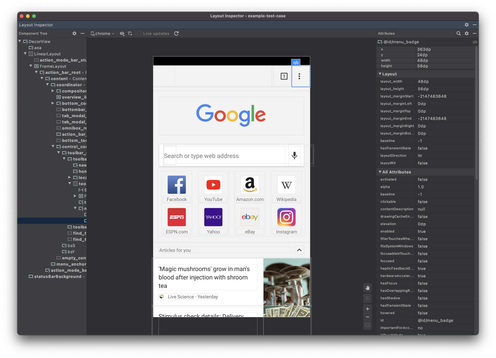

# Instructions for Running UiAutomator Reproduction Scripts

## Execution Script Location

The full set of execution scripts are located in the `reproducing_script_project` [here](app/src/androidTest/java/edu/sage/android).

## Setting up the Example UIAutomator Android Studio Project

This example project uses the Gradle build system. You don't need an IDE to build and execute it but Android Studio is recommended. 

Note that there are two main components of this example project. The first is a "placeholder" app, that is required in order to run the tests. The second are the tests themselves, which are included as part of the project, but require the base app (as well as the app under test) to be installed on an emulator to run. Thus, when you import the project into Android studio you will see two components, the base app with a "MainActivity" class, and an androidTest app with a "SimpleUITest" class. The latter of these two components will need to be replaced with one of the scripts .

To setup the project in Android Studio:

1. Download the project code, preferably using `git clone`.
2. Open the Android SDK Manager (*Tools* Menu | *Android*) and make sure you have installed the *Android Support Repository* under the *SDK Tools* tab.
3. In Android Studio, select *File* | *Open...* and point to the `./build.gradle` file.

After completing these steps, you should then able to access and edit the files in the Android Studio IDE.

## Running the Example Project

There are two ways to run the `reproducing_script_project` project. You can either (i) install the test app and run the tests directly from Android Studio or (ii) generate the app and test apks and install both on the emulator, then use the command line to run the tests.

Before following the two methods below, you should first create and launch an Android emulator through Android Studio's AVD manager that matches the device specifications and Android version associated with the bug. Detailed instructions for setting up an AVD can be found [here](https://developer.android.com/studio/run/managing-avds).

### Option 1 - Run the Test from Android Studio

1. To run the test from Android Studio, you simply need to right click on the number of the test script that you want to run, and click run, to install the app and test apks and run all the tests in the class on the emulator. 

The application will be started on the device/emulator and a series of actions will be performed automatically.

If you are using Android Studio, the *Run* window will show the test results. Please see the gif below illustrating this process on a sample test class.

### Option 2 - Create the app and Test Apks and run the tests from the Command Line

To generate the apks:

1. To generate the app and test .apk files, first execute the gradle `clean` command using the right gradle window in Android studio, or the command line. 
2. Next, execute the `assemble` or `assembleDebug` command in the same manner. 
3. Finally, execute the `assembleDebugAndroidTest` command in the same manner.
3. You will find the two .apk files in the `app/build/outputs/apk/debug/app-debug.apk` and `app/build/outputs/apk/androidTest/ebug/app-debug.apk`

To run the test:

1. Install *both* apks on a running emulator, either by dragging the apk to the emulator, or executing `adb install <path>/app-debug.apk`.
2. Next ensure that you have `adb` installed on the $PATH of your command line and run: `adb shell am instrument -w -e class edu.sage.android.test.Script## edu.sage.android.test/androidx.test.runner.AndroidJUnitRunner` where Script## is the specific test script you would like to run.

See the example Gif below for a demonstration

### Writing your own tests

It is possible to extend this dataset by writing your own tests. To write your own tests, you will essentially copy and edit one of the existing test classes to add the steps that reproduce a certain bug. In order to do this you will need to manually identify different GUI components/widgets by their IDs or other characteristics. The easiest way to do this is through the `Layout Inspector` tool included with Android Studio.

To inspect the UI of a given app follow these steps:

1. Launch the emulator configuration you desire using the AVD manager
2. Install the target, and make note of the package name.
3. Open Android Studio and navigate to `Tools` -> `Layout Inspector`
4. Under the `select process` dropdown in the Layout Inspector, choose your emulator and the app package of the app you would like to inspect.
5. You can then explore and use the viewer to inspect different components

You can find more documentation about the Layout Inspector [here](https://developer.android.com/studio/debug/layout-inspector) See the screenshot below for an example of what this looks like in the Chrome app:

To create your test case:

1. Modify the `BASIC_SAMPLE_PACKAGE` variable to match the package name of the app that you intend to write a test case for.
2. In the `@Test` method, add the API calls to exercise the proper components of the app to reproduce the bug, and use the appropriate JUnit assertions to check conditions for reproduction where necessary. 

For additional documentation about how to write and run uiautomator tests, including the different APIS for exercising various types of components, please see: https://developer.android.com/training/testing/ui-testing/uiautomator-testing 
